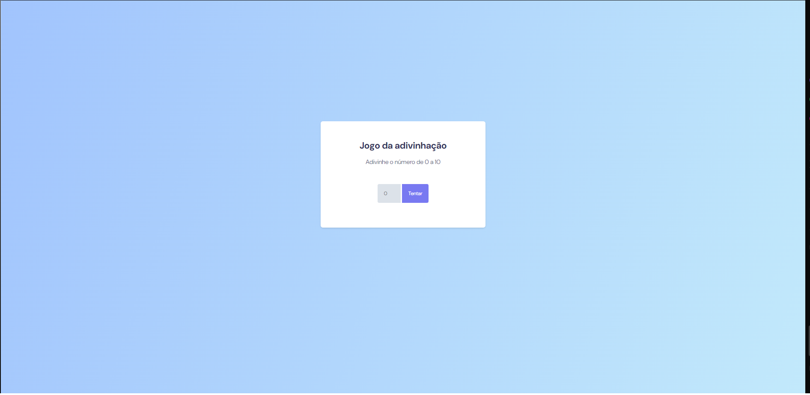
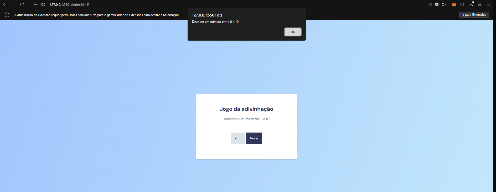
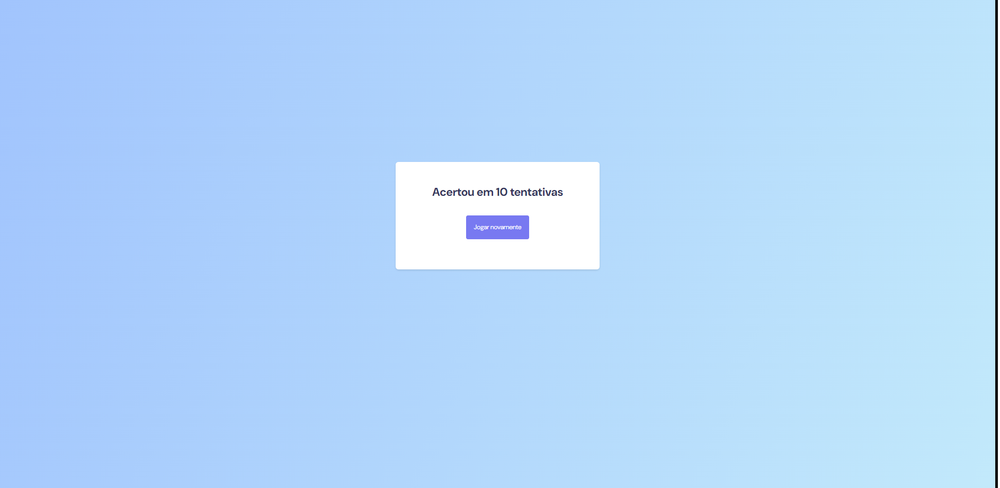

<h1 align="center"> Jogo da adivinhação</h1>

Adivinhe um número entre 0 e 10.  

  <a href="#-tecnologias">Techs/Tecnologias</a>&nbsp;&nbsp;&nbsp;|&nbsp;&nbsp;&nbsp;
  <a href="#-projeto">Project/Projeto</a>&nbsp;&nbsp;&nbsp;|&nbsp;&nbsp;&nbsp;
  <a href="#-layout">Layout</a>&nbsp;&nbsp;&nbsp;|&nbsp;&nbsp;&nbsp;
  <a href="#memo-licença">License/Licença</a>

  

  

  

## 🚀 Techs / Tecnologias

Esse projeto foi desenvolvido com as seguintes tecnologias:

- HTML e CSS
- JavaScript
- Git e Github

## 💻 Project / Projeto

A aplicação é simples, recebe um número entre 0 e 10 e mostra quantas tentativas o usuário teve até acertar.

## 🔖 Layout

Você pode visualizar o layout do projeto através do repositório. 
